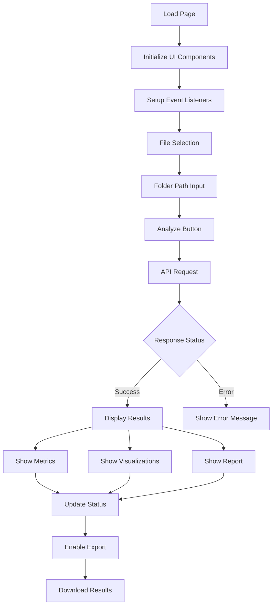
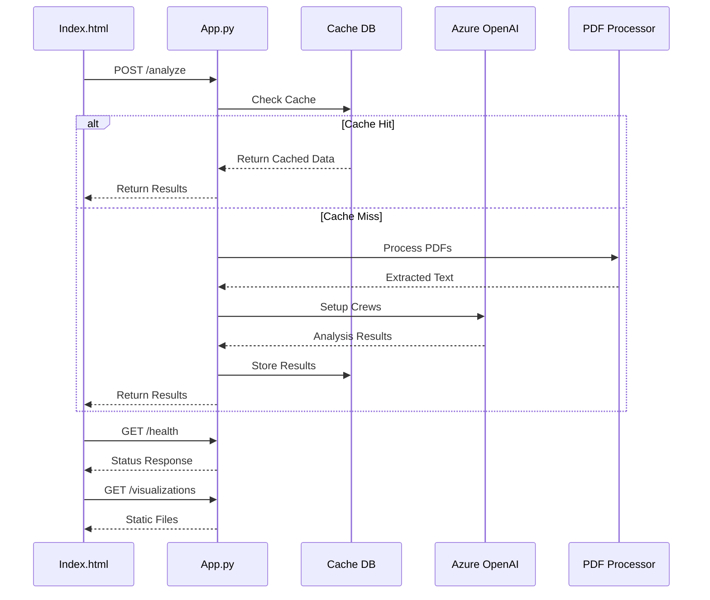

# Application Flow Diagrams

## Table of Contents
1. [App.py Flow](#1-apppy-flow)
2. [Index.html Flow](#2-indexhtml-flow)
3. [Component Interaction](#3-component-interaction)

## 1. App.py Flow

```mermaid
graph TD
    A[Start FastAPI App] --> B[Initialize Components]
    B --> C[Load Environment Variables]
    C --> D[Setup Azure OpenAI]
    D --> E[Initialize Cache DB]
    
    E --> F[API Endpoints]
    
    F --> G[/analyze Endpoint]
    G --> H{Check Cache}
    H -->|Cache Hit| I[Return Cached Results]
    H -->|Cache Miss| J[Process PDFs]
    
    J --> K[Extract Text]
    K --> L[Setup Crews]
    L --> M[Run Analysis]
    M --> N[Generate Visualizations]
    N --> O[Store in Cache]
    O --> P[Return Results]
    
    F --> Q[/health Endpoint]
    Q --> R[Return Status]
    
    F --> S[/visualizations Endpoint]
    S --> T[Serve Static Files]
```

## 2. Index.html Flow



## 3. Component Interaction



## 4. Data Flow Details

### 4.1 App.py Components
1. **Initialization**
   - FastAPI app setup
   - Environment variables loading
   - Azure OpenAI configuration
   - Cache database initialization

2. **API Endpoints**
   - `/analyze`: Main analysis endpoint
   - `/health`: Health check endpoint
   - `/visualizations`: Static file serving

3. **Processing Pipeline**
   - PDF text extraction
   - Crew setup and execution
   - Visualization generation
   - Cache management

### 4.2 Index.html Components
1. **UI Elements**
   - File selection interface
   - Folder path input
   - Analysis button
   - Results display area

2. **Event Handlers**
   - File selection handling
   - Form submission
   - API response processing
   - Error handling

3. **Display Components**
   - Metrics tables
   - Visualization charts
   - Analysis report
   - Status indicators

### 4.3 Data Flow
1. **Request Flow**
   - User input → UI processing
   - API request formation
   - Backend processing
   - Response handling

2. **Response Flow**
   - Data validation
   - UI updates
   - Error handling
   - Cache management

3. **Visualization Flow**
   - Data processing
   - Chart generation
   - Static file serving
   - UI rendering 